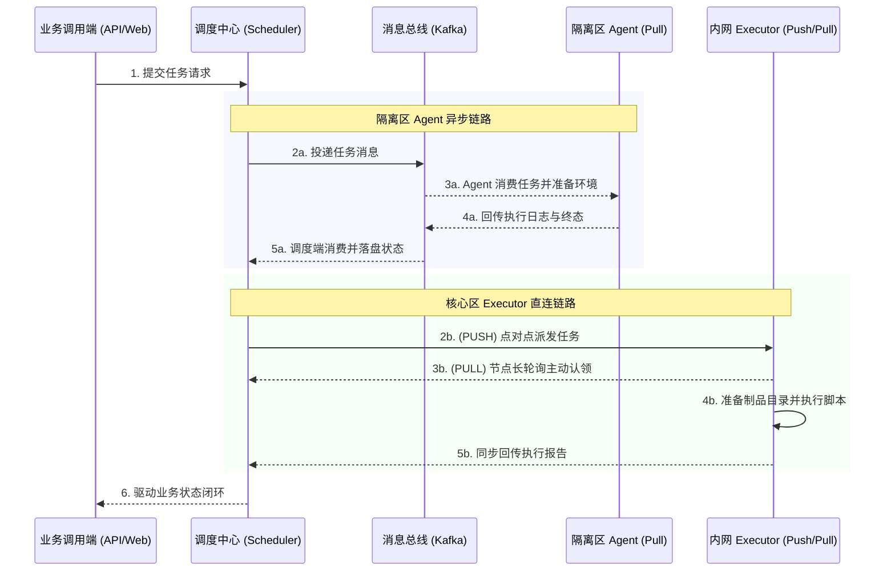

# ETask - 分布式任务调度与异步执行引擎

ETask 是面向自动化运维、离线批处理与异构脚本执行的分布式调度系统。系统采用控制面与执行面分离架构，解决复杂网络隔离环境下的脚本分发、依赖管理与高可靠执行问题。

---

## 核心特性

### 适应多种网络拓扑的分发链路
支持根据不同的网络安全要求灵活选择执行通道：
- **Kafka Agent 模式**：专为隔离区（DMZ / 边缘网络）设计，节点仅需单向访问消息队列，无需对外开放任何入站端口。
- **gRPC PUSH 模式**：适用于高速内网环境，调度端直连执行节点，提供最低调度延迟。
- **gRPC PULL 模式**：执行节点通过长轮询主动认领任务，自带负载反压能力，防止突发流量冲垮工作节点。

### 代码制品与依赖缓存
针对复杂运维脚本、多文件项目与第三方库依赖，内置制品化分发与节点缓存机制：
- **可重现构建**：代码与依赖包统一压缩归档并生成内容摘要，确保相同内容在全网唯一寻址。
- **分层挂载隔离**：支持任务同时挂载公共依赖库与业务源码，提供开箱即用的只读物理目录隔离。
- **节点缓存与复用**：执行节点内置自动缓存与淘汰机制，同制品并发下载自动合并，大幅降低网络开销与任务冷启动延迟。

### 异构脚本执行引擎
系统抽象了通用的执行契约，开箱支持多种主流运维开发语言：
- **Shell**：支持超时打断、退出码捕获与管道结构化输出提取。
- **Python**：提供依赖层挂载与隔离的运行环境。
- **Ansible**：内置动态 Inventory 生成与主机连接管理，支持标准化 Playbook 执行。

### 高可靠与故障自愈
- **可靠终止控制**：支持全链路秒级任务取消，无论任务处于队列排队还是执行中均能可靠拦截。
- **自动化故障补偿**：内置补偿器持续监控超时、心跳丢失或断线任务，支持自动重试与故障转移。
- **数据安全脱敏**：实时执行日志与落盘数据内置脱敏管道，防止凭据和敏感信息泄露。

---

## 架构与流转时序



---

## 运行模式

所有能力整合在单一二进制文件中，通过 `--mode` 参数按需指定运行角色：

| 运行角色 | 适用场景 | 启动命令 |
| :--- | :--- | :--- |
| `scheduler` | 调度控制中心，负责任务编排、状态流转与故障补偿。 | `go run main.go server --mode scheduler` |
| `agent` | 静默执行端，仅单向连接 Kafka，适合网络受限的边缘环境。 | `go run main.go server --mode agent` |
| `executor` | 高性能直连端，提供 gRPC 直连下发与长轮询接入。 | `go run main.go server --mode executor` |
| `all` | 单机聚合模式，单进程集成调度与执行能力，便于本地调试。 | `go run main.go server --mode all` |

---

## 核心技术栈

- **服务开发**：Go 1.25+、[Ego](https://github.com/gotomicro/ego)、gRPC、Gin
- **数据持久化**：MySQL、Goose
- **协调与缓存**：Redis、Etcd
- **消息总线**：Kafka
- **对象存储**：MinIO / S3

---

## 快速开始

### 本地开发联调

确保本地已安装 `task`，且配置文件 `config/all.yaml` 中的基础服务可用：

```bash
# 代码生成与数据库迁移
task gen          # 生成 Protobuf 存根
task wire         # 生成依赖注入代码
task migrate:up   # 执行数据库迁移

# 启动服务
task run          # 启动全功能单机聚合模式
```

### 运行测试
```bash
go test -race ./internal/... ./sdk/...
```

### Docker 部署
```bash
docker compose -f deploy/docker-compose.yaml up -d
```
